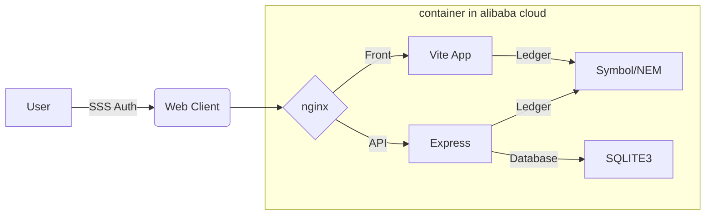

# Decentrized Guild

## Setup Flow

開発環境のセットアップ手順

1. `.env` ファイルを作成して下さい
2. 以下の通りコンテナの起動、実行をして下さい

```sh
docker compose up -d
yarn installs
yarn run dev
```

## Test Net Accounts

Worker/Requester A Bob
- address
  - TA2UYSGSJT6QQA2AS44RF4NFYI7XA7YQSJQW5RY
- private key
  - CC59EA75C5F9FBC787212EC3983BE4731117DD3385EAA383E86D606545F491A2
- public key
  - 832623BE4FF038B95BC1CA437E71082C7F9670A8B5894C1AE54F668EEC7960C1

Worker/Requester B Alice
- address
  - TAEX2JU6RWR6FJTAISUMWKVHJEZWW7K5ABW64XY
- private key
  - 2E6714D78B0940CBFE19F68A5D5B0630BFE80843AAEA8E0EF5AAAF94670C5C1D
- public key
  - 8742FBAA0EF24F273F49260459474EC5DBD4D04C481745616270573F1885FF7D

System 
- address
  - TB6FIH4PNUWWFVDCKJXVGLARE6AVNIP4VP5MCIQ
- private key
  - 09492827DF1BE09A8C5888ED6BBA61943A725EF1C23A52B8A4B510166CB38FD9
- public key
  - 50350DFFB0EB80DE81C3C034DE13AC513A50D725E8EB9C0CF2551DB05C81800A

## Links

**concept**
https://blockchainauthn-my.sharepoint.com/:p:/g/personal/yuichiro_mukaiyama_blockchainauthn_onmicrosoft_com/EfJbjke4HuxMoeFO9OZJAW4BpQOUTJLL_J0K-l5fqfQjyw?e=ZUWoDv

https://drive.google.com/file/d/1Cq2TB0M-2UKSj4KJbTny6XgueYwXHgCA/view?usp=sharing

**todo（projects）**
https://github.com/users/ymuichiro/projects/4/views/1

**screen idea（figma）**
https://www.figma.com/file/gMBKsncyOguhHRZHpJLjk0/D-Guild?node-id=2%3A35

**contract pattern（draw.io）**
https://drive.google.com/file/d/1N3m7ga_QMO0RP2iIYvSiAm4dO_mkikSQ/view?usp=sharing

## Environment

**IDE**
```
{
	"[jsonc]": {
		"editor.defaultFormatter": "vscode.json-language-features"
	},
	"[json]": {
		"editor.defaultFormatter": "vscode.json-language-features"
	},
	"[javascript]": {
		"editor.defaultFormatter": "vscode.typescript-language-features"
	},
	"[typescriptreact]": {
		"editor.defaultFormatter": "vscode.typescript-language-features"
	},
	"[css]": {
		"editor.defaultFormatter": "vscode.css-language-features"
	}
	"editor.tabSize": 2,
}
```

**frontend**

- ui
  - vite（react-ts）
  - mui-material
- store
  - redux
  - useContext
- sdk
  - symbol-sdk@2
  - open-api-generater

**backend**

- server
  - express
- auth
  - SSS
- sdk
  - symbol-sdk@2
  - open-api-generater

**infrastructure**


## Minimum component（hackathon）

Account

- evaluation
- role（Worker, Requester, Guild Owner）
- Quest（list）
- balance（xym & mosaic point）
- Guild（Affiliation）

Work

- Quest Board（Postings, Orders, Rewards）
- Rating Filter

Guild

- evalutation
- Quest Board
- Guild Home Page（link to Community Chat, guild description）
- fee（to guild owner）

Point

- create transaction

Manage

- Tax（aggregate tx or nem?）

Viewer

- Account
- Guild
- Work

## Future compornent

- Senate
- communication room
- fund
- ranking
- philanthropic rewards
- Guild Private Funds

## Submission description （by akindo）

■提出プロダクトの審査内容について

改めてになりますが11/6(日)23:59を締め切りとしている
提出プロダクトの審査基準を以下に案内いたします。

ーーーーーーーーー

Technicality
取り組んでいる問題の複雑さ、またはその解決へのアプローチとは？

Originality
新しい問題や未解決の問題に取り組んでいるか、既存の問題に対してユニークで創造的な解決策を生み出しているか？

Practicality
プロジェクトの完成度や機能性はどうか？想定される利用者が使用できる状態になっているか？

Usability (UI/UX/DX)
プロジェクトは使いやすいか？ユーザーとの摩擦をなくすための努力がなされているか？

WOW factor
従来のプロダクトにはもたらし得なかった新しい視点はあるか？

ーーーーーーーーー

提出プロダクトごとに、総勢24名の審査員に上記指標に基づき点数評価をつけて頂きます。
https://tokyo.akindo.io/#judges

各カテゴリごとにその合計点数が最も高いプロダクトを
提出したチームが11/12(土)のDEMO DAYに進出頂けます。

※11/9(水)にDEMO DAYに進むプロジェクトのアナウンスを行う予定です。

このDEMO DAYはチームから最低お一人、会場となる
WeWork城山トラストタワーにお越し頂きます。
※来場できない場合はご相談させてください。

提出頂くフォームの項目は以下を予定しています。

・プロダクト名
・カテゴリ
・概要（200文字）
・デモ動画URL(5分以内)※Loom推奨
・プロダクトURL
・Github repo(open) URL

Githubのreadmeには審査員が詳細を把握できるよう以下のような情報も入れてください。
・使用したtech stacks
・使用したBlockchain
・deployしたContract(ExplorerでOK）
・application codeやその他のfile
・テスト手順を含むリポジトリへのリンク
・審査やテストのためにプロジェクトにアクセスする方法など

# How to use
## install SSS_extension
<p>本ギルドシステムではSymbolブロックチェーンの署名をブラウザで行うためのSSS_Extension(Chorome拡張)が必要です。
まずはインストールしてください。

https://chrome.google.com/webstore/detail/sss-extension/llildiojemakefgnhhkmiiffonembcan?hl=ja

ギルドで使用するアカウントをSSS_Extensionに追加してください。SSS_Extensionへのアカウント追加方法はこちらから<br />
https://docs.sss-symbol.com/ja/UsersGuide/AccountSetting/
</p>

## Signe Up & Signe In
<p>
以下のページにアクセスしてください。<br />
{{SingIn URL}}<br />

[Connect Wallet]をクリックしSSS_Extensionにて署名しSignUpします。
アカウントの情報はSSS_Extensionより自動的に取得しますのでメールアドレスのみご入力ください。


<br />
[Join Guild]をクリックするとSignUpは完了し、ダッシュボードに遷移します。

アカウントが存在する場合は[Connect Wallet]でダッシュボードに遷移します。
</p>

## Request Quest
*準備中

## Work Quest
<p>
ダッシュボードの[New Job from Board]よりQuestBoardに遷移します。</p>

<br />
<p>現在募集されているQuestが表示されますので、詳細を確認してください。</p>

<br />

<p>
報酬や内容を確認し、受注したいQuestがあれば[受ける]をクリックすることで受注の依頼が行えます。</p>
<b><i> この段階では受注完了ではありません。Requesterが承認して初めて受注完了となります。また、受注にはデポジットが必要です。これはQuestの完了時に返金されます。なお、自動的に徴収されるものではなく、Requesterが受注を承認し、Workerが署名をした段階でデポジットを預け、正式な受注となります。</i></b>
</p>

## Accept Worker
<p>
Requesterはダッシュボードで受注依頼が来ていないか確認できます。</p>

<p>
通知をクリックするとQuestの詳細が表示され[受ける]をクリックすることで受注を承認できます。</p>
<p><b><i>受注の承認には二度の署名、ならびにデポジットが必要です。これはQuest完了報告時に返金されますがSSSに表示される内容をよく確認し署名してください。受注の承認後、Workerが署名して初めて正式な受注となります。</i></b>
</p>

## Approve Quest
*準備中
## Establish Guild
*準備中
## Join Guild
*準備中