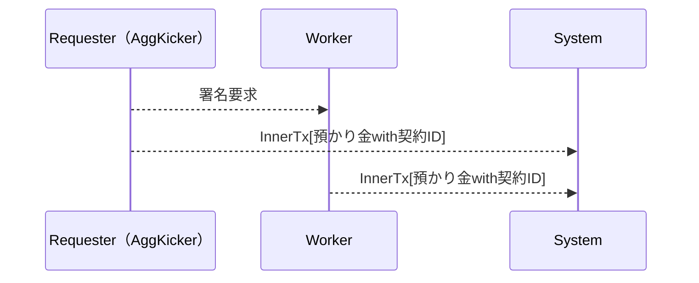
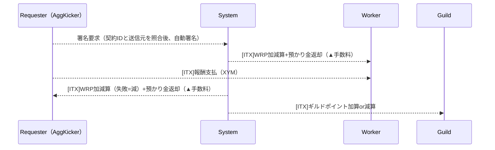
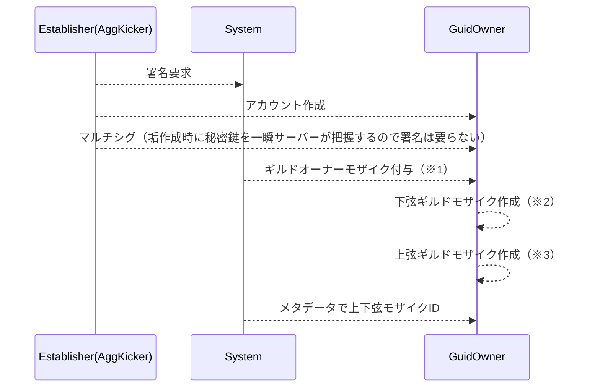
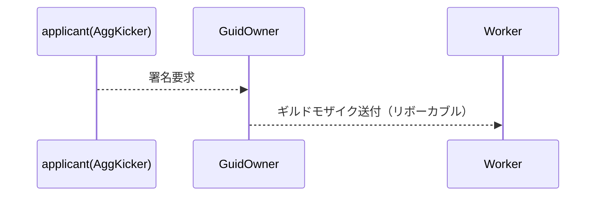
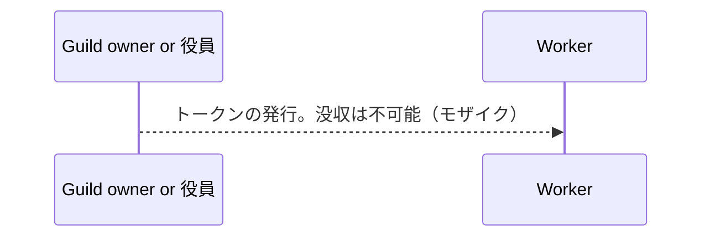
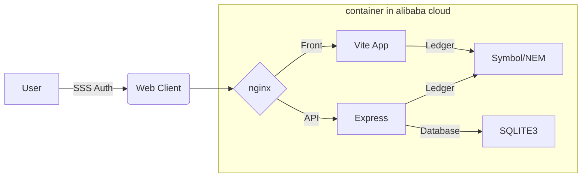

# Decentrized Guild

## 概要

中世のギルドという仕組みをDAOのエッセンスを盛り込んで分散型ギルドプラットフォームとして利用出来ます。Decentrized Guildでは以下のような事ができます。

* 個人間で仕事の受発注が出来ます。もしくはイノベーション活動が行えます。
* 個人"だけ"での受発注だけでなく、一時的なチーム（パーティ）や個人の集団によるバーチャルな組織（ギルド）に参加し、協力して現実世界の仕事やイノベーション活動にあたる事が出来ます
* 契約内容や評価はブロックチェーンに刻まれ、ブロックチェーンを介して自身を証明する事が出来ます
* またプラットフォーム内で動いたお金から税収を回収するプログラムがあり、これを用いて貢献者へ報酬を払ったり、ボランティアに補助金を出したりと公共的な活動も行えます
* システム（プラットフォーム運用者）はプラットフォーム上で動くお金に対して税収を徴収する事が出来ます。税収はプラットフォーム参加者の投票により用途を決める事が出来、誰か単独の人が独断で運用できないようになっています。（マルチシグによる運用が行われます）

このような小さな社会のような機能をプラットフォーム上で利用する事ができ、バーチャルな社会、国のような立ち位置を目指します。


本プラットフォーム内では参加者に対して貢献度に応じてロール（役割）が振られます。ハッカソン期間中の開発では Requester と Worker のみ実装されていますが、各自が役割を適切に処理することで参加者は報酬やプラットフォーム内での資金流動性の向上により、更に富む事が出来ます。

**ロール**
| ロール | 役割 |
| -- | -- |
| Worker | 労働者。仕事を対応するもの |
| Requester | 仕事の依頼者 |
| Guild Owner | ギルドのオーナー。Workerへの支援等を行う事で手数料を徴収出来る |
| Senate | 元老院。システム内にプールされた税金の使い道を決める事が出来る。任期を満了すると報酬を得られる |
| System | プラットフォームを運用するもの。基本見守るのみ。税収の一部をサーバー等の運用費として徴収可能 |

各ロールの更なる詳細は以下PDFを参照下さい
https://drive.google.com/file/d/19RUEIcMrLRQQZdgmq4p9JXWdMeSYY7HJ/view?usp=sharing

## 使用した Tech Stacks
以下の通り構成で開発を行いました。

* フロントエンド ... Node.js,Vite,React,mui-material
* バックエンド ... Node.js,Express
* データベース ... MYSQL
* CI/CD ... GitHub Actions
* コンテナレジストリ ... GitHub Container Registry
* Blockchain ... Symbol,サポートツールとして SSS Extention

※ SSS Extention は本ハッカソンの対象外です。以下Chrome拡張機能として公開されている為、ブラウザ上で安全に秘密鍵を保管する為に活用しました
https://chrome.google.com/webstore/detail/sss-extension/llildiojemakefgnhhkmiiffonembcan?hl=ja

アプリケーションは以下構成にて稼働しています。


## 使用したブロックチェーン

Symbolを利用しました。

Symbol documentation
https://docs.symbol.dev/index.html

Symbol Web
https://symbol-community.com/ja-JP

## 実装したコントラクト

コントラクトの実装は以下にて行っています。（Symbolはプラグイン型のトランザクションシステムを採用しており、既存のロジックを組み合わせて1つのコントラクトを作ります）
https://github.com/ymuichiro/decentralized-guild/tree/main/frontend/src/contracts

コントラクトのフロー詳細は以下の通りになります

### 発注時コントラクトフロー

1つのコントラクト処理内で以下対応を完結する。2つの子トランザクション内で、システムが預かり金の徴収を行いつつ、どの契約IDに対する処理かをオンチェーン上に記録する（契約IDはサーバー内のDatabaseを参照。契約内容全てを記録する事も可能であるが、個人情報等を記載された場合の対応が困難である為、システム的IDのみをコントラクト側には記録を行う）。

※ 預かり金 ... イタズラ、荒らしの防止として契約成立時に一定数の資産を徴収する。契約完了時には返却する。通報があった場合ロックする。



### 納品完了時コントラクトフロー

1つのコントラクト処理内で以下対応を完結する。発注時にシステムは預かり金を得ている為、このタイミングで返却する。ただし、システムは手数料（税収）を徴収する為、この際に預かり金を減産して返却する。



### ギルド設立時コントラクトフロー

ギルドの建設時には以下のフローを行う。トークンの発行が必要であり、この処理を行う前にギルドオーナーに対して消費するトークンの明示を行い、承認があった場合、アカウントやトークンの作成が行われる。GuildOwnerアカウントは発行者のマルチシグアカウントとして構成される。Guild Ownerの変更時はマルチシグアカウントの組み替えで表現とする

※ worker ro requester が申請を行う為、Establisher = worker/requester


- ※1 ... システムがギルドであると証明する為のシステム発行のモザイク。各ギルド共通。
- ※2 ... ギルドオーナーが発行するモザイク。ギルド会員である事を証明する為のリボーカブルなトークン。
- ※3 ... ギルドオーナーが発行するモザイク。ギルド内で貢献者に対してオーナーから渡される。ギルド内での議決権の強さを表す。


### ギルド加入/脱退時コントラクトフロー

ギルド加入の署名はトークンの所有により署名される。このトークンを下位トークンと呼ぶ。没収可能であり、ギルドへの加入有無のみを判別する



### ギルド内評価用ポイントコントラクトフロー

ギルド内で貢献したものに専用のトークンをオーナーより発行する。上位トークンと呼ぶ。下位トークンのみでもギルド運営は可能であるが、上位トークンには以下の意味合いを持たせる。サーバー側には記録されず、所有数はBlockchainへ照会をかけるのみとする。

1. ギルド内で貢献する価値の向上 = 上位トークンの価値向上等でギルドを育てる意義を作る
2. ギルド内での議決権を示す = 上位トークンの所有者はギルド運営に参加が可能。所有数が議決権となる



## How to use
### install SSS_extension
<p>本ギルドシステムではSymbolブロックチェーンの署名をブラウザで行うためのSSS_Extension(Chorome拡張)が必要です。
まずはインストールしてください。

https://chrome.google.com/webstore/detail/sss-extension/llildiojemakefgnhhkmiiffonembcan?hl=ja

ギルドで使用するアカウントをSSS_Extensionに追加してください。SSS_Extensionへのアカウント追加方法はこちらから<br />
https://docs.sss-symbol.com/ja/UsersGuide/AccountSetting/
</p>

### Signe Up & Signe In
<p>
以下のページにアクセスしてください。<br />
{{SingIn URL}}<br />

[Connect Wallet]をクリックしSSS_Extensionにて署名しSignUpします。
アカウントの情報はSSS_Extensionより自動的に取得しますのでメールアドレスのみご入力ください。


<br />
[Join Guild]をクリックするとSignUpは完了し、ダッシュボードに遷移します。

アカウントが存在する場合は[Connect Wallet]でダッシュボードに遷移します。
</p>

## Request Quest
*準備中（本ハッカソンでの実装範囲外）

## Work Quest
<p>
ダッシュボードの[New Job from Board]よりQuestBoardに遷移します。</p>

<br />
<p>現在募集されているQuestが表示されますので、詳細を確認してください。</p>

<br />

<p>
報酬や内容を確認し、受注したいQuestがあれば[受ける]をクリックすることで受注の依頼が行えます。</p>
<b><i> この段階では受注完了ではありません。Requesterが承認して初めて受注完了となります。また、受注にはデポジットが必要です。これはQuestの完了時に返金されます。なお、自動的に徴収されるものではなく、Requesterが受注を承認し、Workerが署名をした段階でデポジットを預け、正式な受注となります。</i></b>
</p>

## Accept Worker
<p>
Requesterはダッシュボードで受注依頼が来ていないか確認できます。</p>

<p>
通知をクリックするとQuestの詳細が表示され[受ける]をクリックすることで受注を承認できます。</p>
<p><b><i>受注の承認には二度の署名、ならびにデポジットが必要です。これはQuest完了報告時に返金されますがSSSに表示される内容をよく確認し署名してください。受注の承認後、Workerが署名して初めて正式な受注となります。</i></b>
</p>

## Approve Quest
*準備中（本ハッカソンでの実装範囲外）
## Establish Guild
*準備中（本ハッカソンでの実装範囲外）
## Join Guild
*準備中（本ハッカソンでの実装範囲外）

## Test Net Accounts

Worker/Requester A Bob
- address
  - TA2UYSGSJT6QQA2AS44RF4NFYI7XA7YQSJQW5RY
- private key
  - CC59EA75C5F9FBC787212EC3983BE4731117DD3385EAA383E86D606545F491A2
- public key
  - 832623BE4FF038B95BC1CA437E71082C7F9670A8B5894C1AE54F668EEC7960C1

Worker/Requester B Alice
- address
  - TAEX2JU6RWR6FJTAISUMWKVHJEZWW7K5ABW64XY
- private key
  - 2E6714D78B0940CBFE19F68A5D5B0630BFE80843AAEA8E0EF5AAAF94670C5C1D
- public key
  - 8742FBAA0EF24F273F49260459474EC5DBD4D04C481745616270573F1885FF7D

System 
- address
  - TB6FIH4PNUWWFVDCKJXVGLARE6AVNIP4VP5MCIQ
- private key
  - 09492827DF1BE09A8C5888ED6BBA61943A725EF1C23A52B8A4B510166CB38FD9
- public key
  - 50350DFFB0EB80DE81C3C034DE13AC513A50D725E8EB9C0CF2551DB05C81800A


# 以下開発用メモ（審査員の方には不要の情報）


## Setup Flow

開発環境のセットアップ手順

1. `.env` ファイルを作成して下さい
2. 以下の通りコンテナの起動、実行をして下さい

```sh
docker compose up -d
yarn installs
yarn run dev
```

## Environment

**IDE**
```
{
	"[jsonc]": {
		"editor.defaultFormatter": "vscode.json-language-features"
	},
	"[json]": {
		"editor.defaultFormatter": "vscode.json-language-features"
	},
	"[javascript]": {
		"editor.defaultFormatter": "vscode.typescript-language-features"
	},
	"[typescriptreact]": {
		"editor.defaultFormatter": "vscode.typescript-language-features"
	},
	"[css]": {
		"editor.defaultFormatter": "vscode.css-language-features"
	}
	"editor.tabSize": 2,
}
```

**frontend**

- ui
  - vite（react-ts）
  - mui-material
- store
  - redux
  - useContext
- sdk
  - symbol-sdk@2
  - open-api-generater

**backend**

- server
  - express
- auth
  - SSS
- sdk
  - symbol-sdk@2
  - open-api-generater

**infrastructure**


## Minimum component（hackathon）

Account

- evaluation
- role（Worker, Requester, Guild Owner）
- Quest（list）
- balance（xym & mosaic point）
- Guild（Affiliation）

Work

- Quest Board（Postings, Orders, Rewards）
- Rating Filter

Guild

- evalutation
- Quest Board
- Guild Home Page（link to Community Chat, guild description）
- fee（to guild owner）

Point

- create transaction

Manage

- Tax（aggregate tx or nem?）

Viewer

- Account
- Guild
- Work

## Future compornent

- Senate
- communication room
- fund
- ranking
- philanthropic rewards
- Guild Private Funds

