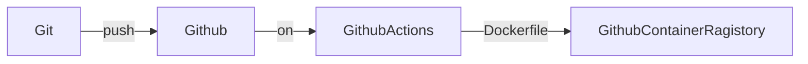

# express-boilerplate

Express 開発環境のテンプレート

# 構成

- Express
- MySql

# デプロイフロー


```mermaid
graph LR;
  Git-->|push|Github
  Github-->|on|GithubActions
  GithubActions-->|Dockerfile|GithubContainerRagistory
```

# 検証用コンテナ

```
docker pull ghcr.io/ymuichiro/express-boilerplate:latest
```
